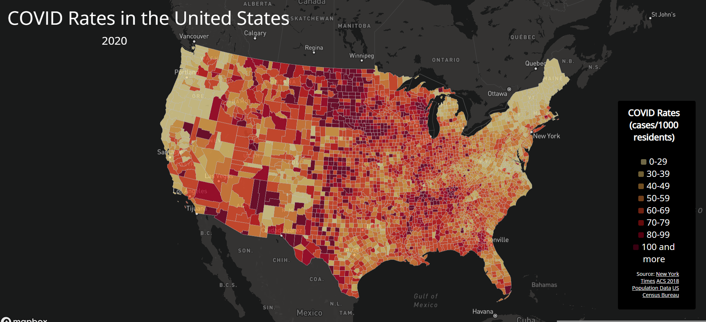
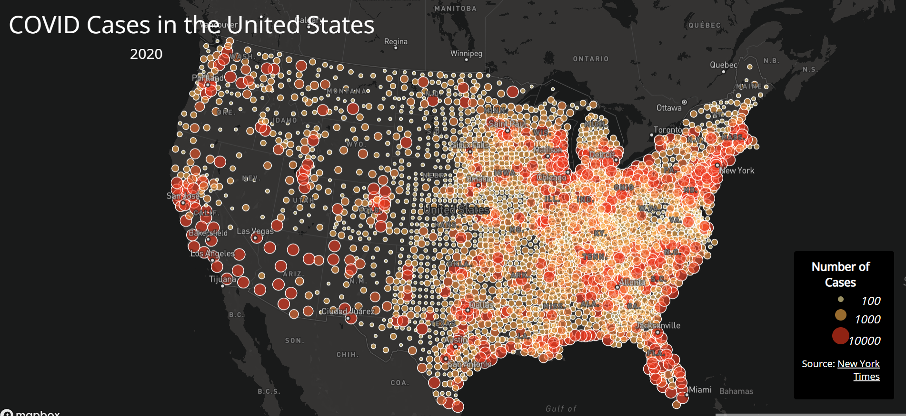

# US COVID Cases in 2020
## Author: Ellen Gorbach

## Introduction
2020 marked the beginning of a difficult period in recent history. The arrival of COVID-19 and its subsequent rapid spread through our population was a turning point in our lives. Over the course of 2020, the constant waves of COVID-19 meant frequent upheavals as everyone learned how to live during the pandemic. The maps below show which counties were hit the hardest by COVID in the span of 2020.

## Maps
[COVID Rates Map - Choropleth](https://gorbachellen.github.io/us-covid-2020-maps/map1.html)

[COVID Cases Map - Proportional Symbols](https://gorbachellen.github.io/us-covid-2020-maps/map2.html)

## Functions

## Libraries, Data Sources, Credits, and Acknowledgement

The data used to make these maps was gathered from:
- [The New York Times (Case/Death Data)](https://github.com/nytimes/covid-19-data/blob/43d32dde2f87bd4dafbb7d23f5d9e878124018b8/live/us-counties.csv)
- [US Census Bureau (US Shapefile)](https://www.census.gov/geographies/mapping-files/time-series/geo/carto-boundary-file.html)
- [2018 ACS 5 Year Estimate (Population Data)](https://data.census.gov/cedsci/table?g=0100000US.050000&d=ACS%205-Year%20Estimates%20Data%20Profiles&tid=ACSDP5Y2018.DP05&hidePreview=true)

All credit for this exercise goes to Professor Bo Zhao for creating it and Steven Bao for processing the above data.

This file will introduce the primary functions(especially the function which was not covered in the lectures), libraries in use